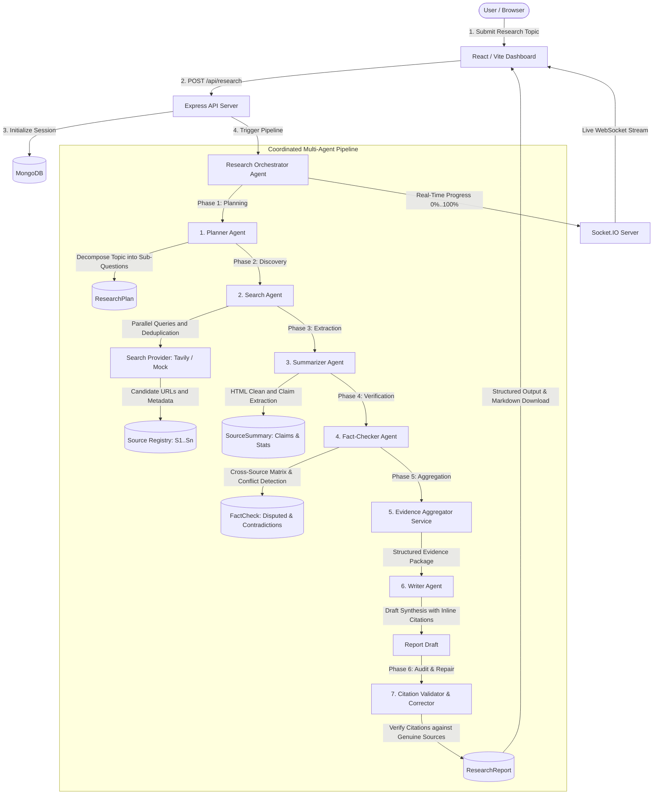

# Multi-Agent Research Assistant 🤖🔍📑

> An autonomous, production-grade multi-agent research platform built with Node.js, Express, MongoDB, Socket.IO, React, and Vite. Coordinates specialized AI agents to decompose questions, search the web, extract empirical claims, detect contradictions, and synthesize peer-grade reports with verified inline citations.

---

## 🏛️ System Architecture



---

## ⚡ Core Features

- **6 Specialized Coordinated Agents**:
  1. **Planner Agent**: Analyzes topic complexity, defines scope, and generates 3–6 structured sub-questions paired with search query vectors.
  2. **Search Agent**: Executes worker-pool concurrency-limited searches, deduplicates URLs by normalized domain, and assigns persistent citation IDs (`[S1]`, `[S2]`).
  3. **Summarizer Agent**: Scrapes web content, scrubs HTML noise (scripts, headers, nav, ads), and extracts structured key claims, statistics, and limitations. Refuses to fabricate data for dead/404 links.
  4. **Fact-Checker Agent**: Evaluates claim consensus across independent sources, calculates confidence levels, and flags empirical contradictions (`claimA` vs `claimB` with reconciliation).
  5. **Evidence Aggregator**: Assembles topic metadata, grouped sub-questions, claims, statistics, and contradiction matrices into a unified Evidence Package.
  6. **Writer Agent**: Synthesizes a structured report (Executive Summary, Key Findings, Sub-Question Analysis, Statistics Table, Contradictions, Limitations, Conclusion).
  7. **Citation Validator**: Scans all `[S#]` tags, verifies they match genuine sources, and autonomously repairs or purges hallucinated references.

- **Real-Time WebSockets**:
  - Live progress tracking (0% to 100%) streamed via Socket.IO.
  - Active agent glow, spinner, and real-time activity log stream.
  - Live discovered sources grid populated as queries resolve.

- **Provider Abstraction (Zero Vendor Lock-In)**:
  - **AI Providers**: Abstract `AIProvider` base class with `OpenAIProvider` (structured JSON mode + exponential backoff retry loop) and `MockAIProvider` for deterministic, zero-cost offline testing.
  - **Search Providers**: Abstract `SearchProvider` with `TavilySearchProvider` and `MockSearchProvider`. Automatically falls back to Mock mode if API keys are not supplied.

- **Interactive Report Dashboard**:
  - Tabbed sections for executive summary, key findings, sub-questions, statistics, and contradictions.
  - Interactive citations: clicking or hovering `[S1]` opens a detailed source inspection popup with URL, domain, and excerpt.
  - One-click **Export Markdown (`.md`)** download and **Copy to Clipboard**.

---

## 📁 Repository Structure

```
multi-agent-research-assistant/
├── backend/
│   ├── src/
│   │   ├── agents/            # Planner, Search, Summarizer, FactChecker, Writer, Orchestrator
│   │   ├── config/            # env.js, db.js, socket.js
│   │   ├── controllers/       # research.controller.js
│   │   ├── models/            # ResearchSession, Source, SourceSummary, FactCheck, ResearchReport
│   │   ├── prompts/           # Planner, Summarizer, FactChecker, Writer system prompts
│   │   ├── providers/ai/      # AIProvider, OpenAIProvider, MockAIProvider
│   │   ├── providers/search/  # SearchProvider, TavilyProvider, MockSearchProvider
│   │   ├── routes/            # research.routes.js
│   │   ├── services/          # source.service.js, evidence.service.js, citation.service.js, progress.service.js
│   │   ├── utils/             # logger.js, retry.js, concurrency.js, errors.js
│   │   ├── validators/        # plan, summary, factCheck, report, citation validators
│   │   ├── app.js             # Express app setup with Helmet & CORS
│   │   └── server.js          # HTTP server & Socket.IO listener
│   ├── tests/                 # 13 Automated test suites (Phases 1-12 + Integration)
│   └── package.json
│
├── frontend/
│   ├── src/
│   │   ├── components/        # Navbar, AgentTracker, SourceCard, ContradictionCard, CitationModal, ReportViewer
│   │   ├── context/           # ResearchContext.jsx
│   │   ├── hooks/             # useResearchSocket.js
│   │   ├── pages/             # Home.jsx, Research.jsx, Report.jsx, ResearchHistory.jsx
│   │   ├── services/          # api.js (Axios REST client)
│   │   ├── App.jsx            # React Router setup
│   │   ├── index.css          # Vanilla CSS Design System with Glassmorphism
│   │   └── main.jsx
│   ├── package.json
│   └── vite.config.js
└── README.md
```

---

## 🚀 Getting Started

### 1. Prerequisites
- **Node.js**: `v18.0.0` or higher
- **MongoDB**: Local MongoDB community server running on `mongodb://127.0.0.1:27017`

### 2. Backend Configuration
Create `.env` inside `backend/` (or copy from `.env.example`):

```env
PORT=5000
NODE_ENV=development
MONGODB_URI=mongodb://127.0.0.1:27017/multi_agent_research
CORS_ORIGIN=http://localhost:5173

# Optional: Add your API keys for live web execution.
# If absent, the system automatically falls back to MockAIProvider and MockSearchProvider!
OPENAI_API_KEY=
TAVILY_API_KEY=
AI_MODEL=gpt-4o-mini
MAX_CONCURRENT_SEARCHES=3
MAX_CONCURRENT_LLM_CALLS=3
```

### 3. Start Backend Server
```bash
cd backend
npm install
npm run dev
# Server runs on http://localhost:5000
# Health check: http://localhost:5000/api/health
```

### 4. Start Frontend Client
```bash
cd frontend
npm install
npm run dev
# Vite dev server runs on http://localhost:5173
```

---

## 🧪 Comprehensive Test Suites

The backend features 13 automated test suites covering every layer of the architecture:

```bash
cd backend
npm test
```

### Individual Phase Test Commands:
| Test Command | Phase Tested | Scope |
| :--- | :--- | :--- |
| `npm run test:health` | Phase 1 | Express Server, Helmet, CORS, and `/api/health` |
| `npm run test:session` | Phase 2 | Mongoose Models, State Transitions, and REST validation |
| `npm run test:ai` | Phase 3 | AI Abstraction, JSON extractor, Mock fallback, and Error hierarchy |
| `npm run test:search` | Phase 4 | URL normalization, domain deduplication, and Search Provider |
| `npm run test:planner` | Phase 5 | Topic decomposition into 3–6 sub-questions & query generation |
| `npm run test:searchAgent` | Phase 6 | Parallel search execution, concurrency limiters, and `[S#]` tagging |
| `npm run test:summarizer` | Phase 7 | HTML noise scrubber, non-fabrication on 404s, and structured claim extraction |
| `npm run test:factChecker` | Phase 8 | Cross-source consensus evaluation and contradiction detection |
| `npm run test:evidence` | Phase 9 | Evidence grouping by sub-question, citation linking, and package assembly |
| `npm run test:writer` | Phase 10 | Structured report synthesis, executive summary, statistics, and Markdown export |
| `npm run test:citation` | Phase 11 | Detection of phantom citations `[S99]` and autonomous regex/catalog repair |
| `npm run test:socket` | Phase 12 | Socket.IO room subscription and real-time streaming of all 8 workflow events |
| `npm run test:integration`| Integration | Full end-to-end pipeline run from initial prompt to completed validated report |

---

## 📡 REST API Reference

| Method | Endpoint | Description |
| :--- | :--- | :--- |
| `GET` | `/api/health` | Service health status |
| `POST` | `/api/research` | Create new research session (`{ topic }`) |
| `GET` | `/api/research` | List past sessions with pagination |
| `GET` | `/api/research/:id` | Fetch session state and research plan |
| `POST` | `/api/research/:id/execute` | Execute complete autonomous research pipeline |
| `POST` | `/api/research/:id/plan` | Trigger Planner Agent step |
| `POST` | `/api/research/:id/search` | Trigger Search Agent step |
| `POST` | `/api/research/:id/summarize`| Trigger Summarizer Agent step |
| `POST` | `/api/research/:id/fact-check`| Trigger Fact-Checker Agent step |
| `POST` | `/api/research/:id/write` | Trigger Writer Agent step |
| `POST` | `/api/research/:id/validate-citations` | Trigger Citation Validator step |
| `GET` | `/api/research/:id/sources` | Fetch discovered and processed sources |
| `GET` | `/api/research/:id/report` | Fetch finalized research report document |
| `DELETE`| `/api/research/:id` | Delete session and cascade delete all related records |

---

## 🔔 Real-Time WebSocket Events

Clients connect to Socket.IO and emit `session:join` with `{ sessionId }`. The server streams progress updates to room `session:${sessionId}`:

| Event Name | Stage | Progress | Description |
| :--- | :--- | :--- | :--- |
| `research:started` | `INIT` | 5% | Topic received and session initialized |
| `research:planning` | `PLANNING` | 15% | Decomposing topic into sub-questions |
| `research:searching` | `SEARCHING` | 25%–40% | Executing web search queries across sub-questions |
| `research:summarizing` | `SUMMARIZING` | 45%–65% | Cleaning HTML and extracting claims/stats |
| `research:fact-checking` | `FACT_CHECKING`| 70%–75% | Cross-verifying claims and detecting contradictions |
| `research:writing` | `WRITING` | 80%–90% | Synthesizing report sections |
| `research:validation` | `VALIDATION` | 92% | Auditing inline `[S#]` citations against genuine catalog |
| `research:completed` | `COMPLETED` | 100% | Full report ready with citations and statistics |
| `research:error` | `FAILED` | 0% | Unrecoverable error notification |

---

## 🛡️ Anti-Hallucination & Citation Integrity Guarantee

1. **Deterministic Indexing**: Sources receive sequential citation tags (`[S1]`, `[S2]`, ...) during the search phase. These IDs are stored in MongoDB.
2. **Evidence Packaging**: The Writer Agent is strictly instructed to draw factual assertions **only** from the supplied Evidence Package and use registered tags.
3. **Automated Audit**: Before presenting the report, the `CitationValidator` scans all text, arrays, and markdown for citation patterns (`/\[(S\d+)\]/g`).
4. **Autonomous Correction Loop**: If any non-existent source tag (e.g. `[S99]`) is detected, the `CitationService` automatically sanitizes or remaps the reference and re-validates before declaring `COMPLETED`.

---

## 📜 License
Developed as a production-grade multi-agent architecture project. MIT License.
